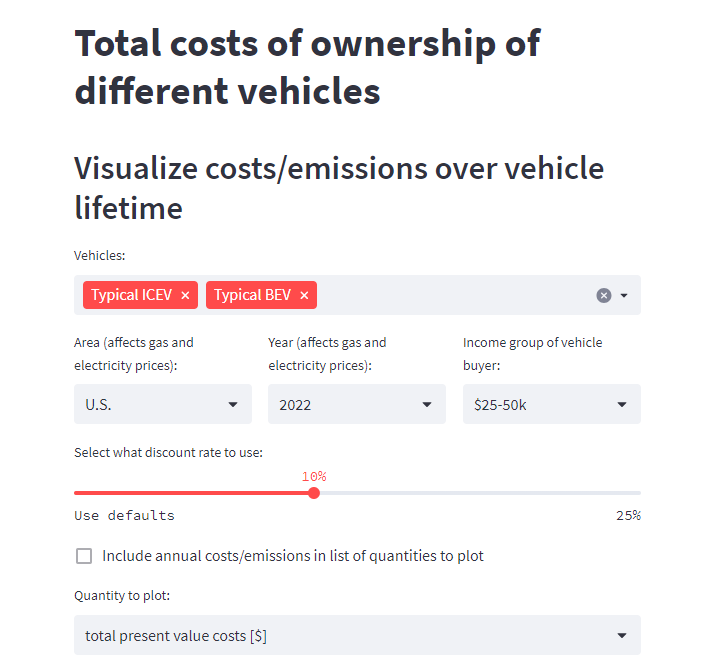

# Vehicle Consumer Choice Tool

## About

The presented modeling framework was developed as part of a graduate research project at the University of Washington. It allows to assess the cost differences between conventional vehicles (ICEVs) and electric vehicles (EVs) on a total cost of ownership basis. The nominal costs were furthermore discounted to account for the fact that people value the money they have or spend today more than in the future.

The modeling framework allows for the flexible assessment of a variety of different input combinations. EV total costs of ownership were found to be lower than those of ICEVs in nominal terms, for all geographic areas and vehicle types except for sedans, due to the prevalence of the high-end Tesla Model S in the market. The tool reveals the dependency between maximum allowable discount rates for EVs to remain the financially more attractive alternative on the one hand and socioeconomic factors, driving patterns, and vehicle types on the other hand. Electric vehicles represent the most viable alternative especially when consumers intrinsically apply low discount rates, when they have a high annual mileage, and hang on to their vehicle for longer than the average does. In quite a few cases, discount rates can be excessively high while the EV remains the financially more viable alternative.

A publicly accessible online tool was developed to allow users to interactively explore the results and visualize nominal and discounted cost differences between conventional and electric vehicles. It can be accessed at [<vehicle-consumer-choice-tool.streamlit.app](https://vehicle-consumer-choice-tool.streamlit.app/). This GitHub repository is <https://github.com/steffen-coe/vehicle-consumer-choice-support-tool>. The tool utilizes the
Python Streamlit package, allowing users to dynamically update the results based on the chosen scenarios. The tool is available under an [MIT License](LICENSE).

**Screenshot of the app's selection menu (click on the image to go to the tool):**

## Waterfall plots

Waterfall plot visualizing the cost differences between a typical ICEV and a typical EV in the different cost categories. Positive (red) values denote higher costs for the EV, whereas negative (green) values show cost savings for the EV. The left bar in each cost category represents nominal (future value) cost differences, the right bar represents discounted (present value) cost differences, at the default 5% discount rate.

.png)

.png)

.png)

.png)

## Usage

The application can be found under <vehicle-consumer-choice-tool.streamlit.app>.

The application was written in the Python programming language and used on the Python version 3.8 (downward capability given at least to Python 3.5), using the [Streamlit interface](https://streamlit.io/) to produce an interactive user interface with tables and visuals.

## Pages (`pages/*`)

The code for the individual pages in the Streamlit app is contained in the files the `pages/` folder. Within each of these files, when the respective tab in the app's sidebar is selected, the respective file is called and executed, printing the page content in the app.

## Licensing

See the [LICENSE](LICENSE) file for licensing information as it pertains to files in this repository.

## Requirements

Please see the [requirements](requirements.txt) for Python requirements and dependencies.

## Contact

The author is happy to be contacted via email for any questions or help regarding the use of this app.

+ Steffen Coenen (steffen.coenen [at] web.de)

## Documentation

Further documentation can be found in the code. Each function contains its own documentation with description of all function parameters.
